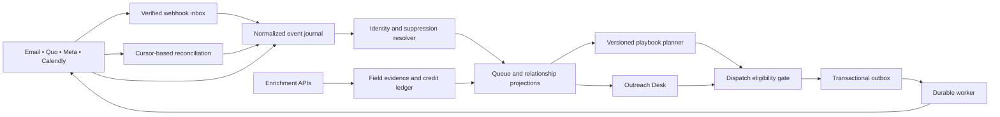

# Outreach Desk: product and implementation plan

24 September 2026 · proposal for implementation · source baseline `1daa778`

## 1. Outcome and scope

The agent signs in and immediately knows **who to contact, why now, what to say, which channels are available, and what happens next**. Her job is the conversation. The system prepares the work, records evidence, coordinates permitted follow-ups, and surfaces exceptions.

Deliver the new tab inside the existing CRM. Proposed canonical URL: `/crm?tab=outreach-desk`, default for `/crm` when no valid explicit tab is requested. Preserve links to Clients, Campaigns, Reports and the existing Call Queue. Initially add Outreach Desk; consolidate the duplicate agent/CRM navigation after the workflow succeeds. Broker, franchisee, marketing and mobile portal entry points keep their role-specific destinations.

Success is held, qualified meetings and progressing relationships. Open counts, dialer launches and drafted messages are supporting activity measures. A perfectly autonomous sales process cannot be promised; the design targets autonomous preparation and bounded execution with explicit exception ownership.

## 2. What already exists

This is a source inspection, not a production integration-health audit.

| Capability | Current evidence | Reuse / change |
|---|---|---|
| Backend entry | `client/src/pages/login.tsx` sends admins to `/crm`; `crm.tsx` defaults to Clients | Add first Outreach Desk tab and change fallback, preserving explicit deep links |
| Human call queue | `client/src/pages/call-queue-tab.tsx`, `server/call-queue-service.ts`, `call-queue-routes.ts`, helpers/tests | Extend the existing queue rather than creating a competing task engine |
| Engagement | `drip_sends`, `crm_direct_emails`, `server/tracking-bot-filter.ts`, tracking routes | Preserve raw signal provenance; replace binary confidence language with observed/likely/unknown/machine |
| Campaign activity | `client/src/pages/email-campaigns.tsx`, campaign/activity endpoints in `server/routes.ts` | Reuse event and enrollment IDs; supply campaign-to-person exploration |
| CRM identity | `crm_clients`, `contacts`, `prospects`, `agent_leads`, `partner_leads` | Add a canonical person reference and source links; incremental migration |
| Voice/SMS | `server/quo-service.ts`, `server/openphone-calls.ts`, `phone_calls` | Provider call/message events, reliable matching, status transitions, account-level rate limits |
| WhatsApp | `server/meta-whatsapp-service.ts`, `/api/webhooks/whatsapp` | Add channel evidence, template/window gates and delivery-state reconciliation |
| Meetings | `server/calendly-service.ts`, `server/meetings.ts`, `/api/meetings/webhook` | Verify live subscription payloads/signatures, cancellation/reschedule mapping and booking receipts |
| Outreach machine | `server/outreach-intelligence-service.ts`, outreach drafts/daily plans, partner sequences, cron jobs | Keep research/draft logic, centralize dispatch policy and durable jobs |
| Enrichment | `server/prospect-enrichment.ts`, `lead-email-enrichment.ts`, provider adapters | One waterfall, cache, provenance, negative results, cost ledger and budget ceiling |
| Email | `server/email-service.ts`, `server/core/email-queue.ts`, sender/deliverability services | Retain working transport; unify replies and suppressions before auto-follow-up expansion |

Specific hardening findings from inspected code:

- Current dial interaction launches `tel:` and calls a `/dial` endpoint. Treat that as a handoff request, not proof that Quo connected a call.
- The bot filter uses user-agent patterns, short timing windows, and a count threshold. These heuristics cannot prove a human opened or clicked. Avoid escalating all unfiltered hits as verified intent.
- Existing call deduplication compares a suffix of phone digits. Replace identity matching with country-aware E.164 and ambiguity handling before expanding internationally.
- Current UI falls back to America/New_York for missing timezone and permits a check-hours state on invalid timezone. The new eligibility service must hold unknown timezones and return the reason.
- Some provider readers return an empty list on missing configuration or error. Expose `unconfigured`, `healthy`, `delayed`, `error`, and `partial` separately from a successful empty result.
- The call service can write a synthetic meeting ID for a manually logged booking. Preserve such records as agent-reported until reconciled with a provider receipt; reporting must distinguish them.
- Scheduled work is substantially initiated in the web process. Introduce durable jobs and database leases before adding more autonomous writes or multiple replicas.

## 3. Daily agent experience

**Before her shift:** sync replies, bookings, messages, calls and suppressions; repair gaps; refresh stale high-priority contact fields; resolve permitted calling windows; publish a brief showing freshness and exceptions. Configure shift timezone explicitly rather than assuming where she works.

**At sign-in:** Today shows callbacks due, new replies, engagement-led calls and cold prospecting in that order. A small outcome bar shows calls confirmed by the provider, conversations, booked meetings and held meetings. Each queue card explains its reason and local time.

**Before a call:** selecting a person reveals contact channels, verification dates, prior messages, campaign and exact subject, last conversation, sourced facts, approved pitch, likely questions and one desired next step. The system avoids “I saw you open my email.”

**After a call:** she chooses an outcome, edits the brief note and confirms any commitments. The system suggests the next action and creates permitted follow-ups. She can save and move to the next eligible person without browsing other tabs.

**Throughout the day:** replies or bookings stop prospecting immediately; the queue refreshes without interrupting an active conversation. An inbound reply pins that person into Needs response. After shift end, she sees relationships progressed, commitments due tomorrow and items needing the owner.

## 4. Workspace modules

| Module | Agent's question | Required behavior |
|---|---|---|
| Today | Who should I speak to next? | Ranked queue, due callbacks, open-only segment, call-now eligibility, why-ranked explanation, ownership and claim lease |
| Campaign explorer | Who engaged with this email? | Campaign/step/date filters; observed opens vs stronger signals; unique recipients; reply/booking state; search; saved views |
| Person workspace | What do I know and how do I reach them? | Email/phone/WhatsApp/LinkedIn identities, source and freshness, channel availability, relationship history, notes, brief and scheduling |
| Follow-ups | What is waiting on me or the machine? | Unified inbound triage, drafts, scheduled messages, tasks, pending receipts, failures and one-click correction |
| Automations | What happens automatically? | Versioned playbooks, preview on example records, activation state, limits, exceptions, per-channel pause and global pause |
| Connections | Can I trust today's data? | Real provider read-back, webhook freshness, sync cursors, pending enrichment, credits, stale/error states and recovery tasks |
| Manager reporting | Are conversations turning into business? | Segment funnel, agent capacity, meeting-held and qualification measures, attributable campaign cohorts and data freshness |

Search first ships as fast structured search: names, normalized email, phone, company, campaign name and notes permitted by role. Filters: campaign, step, sent/opened/clicked/replied dates, signal confidence, owner, track, timezone/country, language, next action, phone status, suppression and booking state. All filters combine with AND; multi-select values within a filter use OR. Date boundaries use an explicit reporting timezone and are serialized in the URL.

Saved views: “Replies without a meeting”, “Callbacks due”, “Campaign opens · last 7 days”, “Likely clicks · callable now”, “Phone missing”, “New cold prospects”, “No-show recovery”, and “My active relationships”. Natural-language search is an optional second phase: translate to a validated filter object, display the interpretation, and require no model-generated SQL.

Deduplicate people in results while retaining all matching campaign evidence. “Three opens” means three observed events, not three humans or three campaigns. Use cursor pagination, stable ordering and total counts calculated server-side. Never load the entire contact database into the browser.

## 5. Ranking and channel eligibility

Use deterministic rules before introducing learned ranking. The model writes a brief; it does not decide eligibility.

Priority tiers: (1) requested callbacks due and inbound requests for contact, (2) positive replies without confirmed meetings, (3) high-fit prospects with recent likely clicks or first-party form activity, (4) repeated observed opens with supporting fit, (5) approved cold prospects. An open alone can appear in campaign search but does not trigger an urgent interruption or extra cross-channel messages.

Within a tier, sort by due time, evidence recency, reachable verified channels, explicit fit and least recent contact. Show the ingredients rather than an unexplained precision score. Cap duplicate-event contribution; age weak engagement out after a configurable window. Different buyer/partner criteria and scripts are mandatory. Self-reported interests may inform fit; inferred wealth, immigration status or nationality must not.

Before exposing **Call now**, evaluate owner, contact identity, phone validity, timezone evidence, local business hours, applicable DNC policy, opt-outs, attempt/frequency cap, callback promise and current booking status. Re-evaluate on action, not only at page load. Unknowns produce a specific hold task. Being in the queue is not permission to message on every channel.

Every channel has separate eligibility with `allowed`, `held`, `unavailable`, reason, evidence source, evaluatedAt and policyVersion. Opt-outs can be channel-specific or global; ambiguous “do not contact me” becomes a global stop. A model cannot override suppression.

## 6. Automation playbooks

| Trigger | Autonomous preparation/action within an activated policy | Agent contribution | Stop/exception |
|---|---|---|---|
| Daily shift brief | Sync, dedupe, enrich priority gaps, verify, rank, summarize and prepare tasks | Work the queue | Stale provider -> degraded badge; hold dependent automated sends |
| New campaign open | Record uncertain signal; update campaign search | Choose whether to call | No consent inference, no instant SMS/WhatsApp |
| Likely relevant click | Raise eligible person in queue; prepare brief | Human call | Scanner suspicion, prior meeting or suppression blocks escalation |
| Positive reply | Pause all prospecting; summarize request; draft answer and scheduling options | Review substantive response and relationship decision | Low confidence or sensitive questions stay in review |
| No answer | Log attempt; calculate next allowed attempt; draft an approved email | Choose voicemail/notes if appropriate | Maximum attempts, missing eligibility, quiet hours or reply stop further steps |
| “Send me details” | Prepare relevant approved brochure and short recap | Confirm requested content and channel once | Product claims outside approved material -> owner review |
| Callback requested | Save exact recipient-local date/time, convert with IANA zone; reserve task | Confirm requested time | Missing timezone -> clarify; do not infer from phone prefix alone |
| Meeting confirmed | Cancel pending prospecting; prepare brief and permitted reminders | Prepare and attend; record qualification/held outcome | Confirmation requires provider booking identity |
| No-show/cancellation | Draft reschedule request; await policy-eligible next action | Decide whether to re-engage | A reschedule event pair must not trigger extra prospecting |
| Wrong number | Suppress that number; try bounded enrichment for another authorized channel | Validate replacement when ambiguous | Do not mark the whole person DNC unless requested |
| Opt-out / DNC / complaint | Immediate suppression and cancellation of pending actions | Resolve any ambiguous scope conservatively | No automatic re-enrollment |
| Provider rejection/unknown send | Quarantine action, reconcile status, create concise exception | Owner fixes connection/policy | Never retry a possibly accepted send blindly |

Start with assisted mode: auto research/sync/draft, manual outbound approvals. Graduate selected playbooks to approved execution after receipts, suppressions and failure paths pass pilot checks. Mature mode automatically handles eligible templated follow-ups, reminders, CRM updates and routine acknowledgments; novel pitches, sensitive claims, relationship decisions and LinkedIn sending remain human-controlled. One playbook approval can cover its bounded future actions—do not force her to approve every identical routine step indefinitely.

Proposed pilot cadence, subject to owner policy: no more than one prospecting touch per person per local day and three touches over seven days, with callbacks and requested materials separately classified. No-answer: next eligible day, then three working days later, then stop/nurture. Use a deterministic per-person schedule with jitter, never random changes to an agreed callback. These are proposed product defaults, not legal limits or evidence of an optimal conversion rate.

## 7. API and data architecture

Keep React/Wouter/TanStack Query, Express/TypeScript, PostgreSQL and Drizzle. Start with a PostgreSQL job/outbox table and `FOR UPDATE SKIP LOCKED` worker leases. Add another queue product only when measured throughput or operational requirements justify it. Define modules under `server/outreach-desk/` instead of adding another large block to `server/routes.ts`.

Proposed additive entities (migration names are design proposals):

| Entity | Key contract |
|---|---|
| `people` / `person_source_links` | Canonical person ID, existing record type/id links, tenant/workspace, owner; reversible merge audit |
| `contact_points` | Email/E.164/profile URL, source, verifiedAt, confidence, invalidation reason; shared contact points allowed without forcing identity merge |
| `engagement_events` | Provider/account/event ID unique, campaign/send IDs, occurredAt/receivedAt, machine/unknown/likely classification, classifier version |
| `channel_permissions` | Person/contact-point/channel/jurisdiction scope, grant or denial, purpose, evidence, expiry, source and policy version |
| Existing `call_queue` + attempts | Canonical person FK, task type, due time, claim owner/lease, next-action reasons, optimistic version |
| `conversation_threads` / messages | Provider account/thread/message ID, direction, draft/queued/accepted/delivered/failed states, attachments metadata |
| `automation_enrollments` | Person/playbook version, state, next step, stop reason; one active prospecting enrollment per person in the selected scope |
| `outbox_actions` / receipts | Stable action id, dedupe key, scheduledAt, eligibility snapshot, provider receipt, attempt state, uncertain outcome |
| `integration_cursors` / jobs | Account cursor, last successful read, lag, error, checkpoint and retry budget |
| `enrichment_runs` / field evidence | Provider request ID, candidate values, resolution rule, checkedAt, expiresAt, credit and monetary cost |

Use verified exact identifiers where possible; source-record mappings are authoritative. Never fuzzy-merge solely on a name or phone suffix. A shared office phone or shared mailbox may belong to multiple people. Queue ambiguous matches for review. Human-verified values outrank provider guesses, with explicit stale/invalid overrides; retain provenance instead of silently overwriting.

### Proposed API contracts

- `GET /api/outreach-desk/brief` -> shift context, metrics with freshness, queue counts, exception summary.
- `GET /api/outreach-desk/queue?view=&campaignId=&signal=&q=&cursor=` -> items, eligibility, evidence and nextCursor.
- `GET /api/outreach-desk/people/:id` -> normalized profile, channels, active campaigns, timeline, sourced brief.
- `POST /api/outreach-desk/queue/:id/claim` -> lease or 409; protects concurrent work.
- `POST /api/outreach-desk/queue/:id/call-handoff` -> intent ID and permitted destination; no connected-call claim.
- `POST /api/outreach-desk/queue/:id/outcome` -> validated outcome/notes/next action with idempotency key and expected version.
- `POST /api/outreach-desk/drafts/:id/approve` -> validated current eligibility then outbox action, not “sent”.
- `GET /api/outreach-desk/automations/:id/preview` -> sampled proposed actions and reasons, with zero dispatch.
- `POST /api/outreach-desk/automations/:id/pause` -> block new sends and cancel not-yet-dispatched actions atomically.
- `GET /api/outreach-desk/integrations` -> capability/access/health/freshness/budget state, never secret values.

Zod schemas, typed response unions, bounded inputs and database parameterization apply throughout. Server-side role checks: agent sees assigned work and approved shared records; manager can change playbooks/ownership; admin manages credentials. This requires an agent role because the existing CRM currently gates on admin. Validate session CSRF protections, output escaping and row scope for all new mutations.

### Reliable execution

Persist incoming webhook bytes, validate the provider's actual signature/authentication and timestamp/replay requirements, deduplicate, acknowledge quickly, process asynchronously. Where a provider lacks signed callbacks, use its supported protection plus request correlation and authenticated API reconciliation before trusting consequential claims. Do not assume one generic HMAC scheme works for every provider.

Normalize provider statuses; tolerate duplicates and out-of-order events. On unknown outbound result, reconcile with provider message ID/idempotency support before retry. An outbox alone cannot guarantee exactly-once delivery across a provider without idempotency: quarantine unresolved sends rather than doubling them. Recheck stop state immediately before dispatch using row locks/versioning; use a per-person dispatch lease so competing channels cannot send simultaneously. Already in-flight messages may be irrevocable; record that race explicitly.

Retry 429/transient failures with exponential backoff and jitter, respect Retry-After, use per-provider/account rate buckets and a bounded retry budget. Authentication/validation failures need intervention. Circuit breakers pause dependent actions. Dead-letter tasks identify the owner and next repair step. Record sanitized structured logs, decision/version IDs, correlation IDs, token counts, costs and latency. No secrets or unnecessary message contents in logs.

Untrusted emails, web pages and enrichment text are data, never agent instructions. Brief generation uses a fixed schema and approved product knowledge; source links anchor factual statements. Models cannot access raw provider credentials or unrestricted send tools. No fabricated investment returns, visa promises, inventory availability, fee quotes, or FDD claims. Use approved current material and route legal/product exceptions to the owner.

## 8. Refresh schedule and data quality

| Data | Proposed cadence | Fallback / stale behavior |
|---|---|---|
| Replies, opt-outs, call/message status, bookings | Provider events near real time | Incremental reconcile every 5–15 minutes where allowed; alert on lag |
| Gmail push if adopted | Renew daily; consume history cursor | History gap -> bounded full reconciliation; stale replies block autonomous prospecting |
| Daily agent brief | 30 minutes before configured shift | Regenerate missing pieces; show partial completion and source timestamp |
| Contact fields | Reuse fresh cache; refresh due-task gaps daily | Enrich only highest-priority eligible contacts within caps |
| Email verification | Before first send and when stale; proposed 30-day TTL | Invalid suppresses address; unknown/catch-all requires configured policy |
| Phone/company | Proposed 90-day refresh, earlier on bounce/wrong number/job change | Source disagreement -> review; never overwrite confirmed detail blindly |
| DNC/policy evidence | Evaluate every action against required current source | Expired or missing evidence holds the action |
| Deliverability/provider health | Rolling and hourly health checks | Pause affected sender/channel; preserve other eligible work |
| Metrics | Event-driven projections and daily reconciliation | Expose reporting cutoff and incomplete source data |

Proposed SLOs for pilot validation, not measured present performance: p95 search under 500 ms on a representative 100k-person dataset; p95 provider event to queue update under 60 seconds excluding provider delay; zero known duplicate dispatches in replay tests; every accepted action has an eventual receipt or actionable exception. Refreshing the whole database daily is not a requirement.

## 9. Meeting handoff and sales enablement

One 20-minute introduction goal per call. The agent sees verified scheduling links/availability for the appropriate owner and track. Sending a booking link is `link_sent`; recording a proposed time is `booking_pending`; Calendly confirmation is `confirmed`. Meeting held and qualified are separate, recorded outcomes with a definition the team agrees on.

The brief passed to the closer includes expressed goals, declared timeline, product interest, questions, last touch, requested materials and commitments. Avoid asking the agent to retype anything already in the call note. Transcription and recording depend on account support and applicable disclosure rules; unrecorded calls still support manual structured notes.

Approved talk track: permission opener → one relevant value point → two discovery questions → next-step invitation. Partner script emphasizes the referral process; buyer script explains franchise operations without promising immigration outcomes. The AI can draft in the contact's explicitly recorded language; use reviewed translated templates before auto-sending.

## 10. Phased delivery

Planning estimate: approximately 5–8 engineering weeks for one experienced engineer with product feedback, overlapping integration work where feasible. Provider access, market-policy review and data cleanup can extend this. This is an estimate, not a delivery commitment.

| Phase | Deliverable | Exit condition |
|---|---|---|
| 0 · 2–3 days | Read-only provider/access inventory; agree audience, agent role, hours, approved material and operating caps | Capability matrix verified against actual accounts; representative redacted event fixtures |
| 1 · 1 week | Outreach Desk as default tab, queue/profile/campaign search using existing data | Deep links/auth intact, responsive UI, true loading/error/empty states, no duplicate queue engine |
| 2 · 1–2 weeks | Canonical identity links, event journal, receipts, suppression and durable outbox/worker | Replay, concurrency, race and outage tests pass; read-only shadow projections reconcile |
| 3 · 1–2 weeks | Quo handoff/result sync, unified replies, Meta eligibility, Calendly reconciliation, one enrichment waterfall | End-to-end test contact lifecycle with actual provider receipts in staging/test accounts |
| 4 · 1–2 weeks | Activated bounded playbooks, daily prep, meeting handoff, exceptions and reporting | Small assigned cohort succeeds in assisted mode, then selected automatic steps enabled |
| 5 · continuous | Tune capacity, copy, ranking and enrichment by held qualified meetings | Weekly cohort review and controlled experiments, with rollback criteria |

Migration uses additive tables, batch backfills with checkpoints and source counts, conflict reports, and shadow-read comparison. Preserve existing IDs and audit trails. Do not enable dual schedulers: transfer one playbook/provider at a time behind feature flags and disable its previous dispatcher. Rollback switches UI to the existing tab and pauses new automation without deleting events or dispatching old pending work. Maintain independent flags for default UI, read projections and outbound execution.

## 11. Acceptance and test plan

1. Admin/authorized agent login defaults to Outreach Desk; explicit old URLs work; broker/mobile access boundaries remain intact.
2. Campaign opens search returns unique people with the exact matching campaign/step/date evidence. Scanner-only traffic and unknown opens are labelled correctly.
3. A person with several source records has one active work item; ambiguous shared-phone matches are not silently merged.
4. A dialer click remains a handoff; provider call ID proves a call occurred; connection/duration come from provider facts.
5. Positive reply, booking, opt-out and complaint stop scheduled prospecting across channels, including concurrent dispatch tests.
6. A booking-link click never increments booked meetings; reschedule event order does not resume outreach or duplicate reminders.
7. Unknown timezone, DNC evidence expiry, invalid phone and missing channel permission block relevant actions server-side.
8. Duplicate/out-of-order webhooks, expired auth, 429, timeout-after-acceptance, malformed payload and worker restart have safe, visible outcomes.
9. Quo/Meta/email delivery failure is displayed as failure; stale integrations are not displayed as empty healthy results.
10. Enrichment stops at budget, pending callbacks resolve to the correct person, and manual verified fields survive conflicting provider results.
11. Read scope, object ownership, CSRF/session, secret redaction, recording access and prompt-injection fixtures pass review.
12. Keyboard navigation, screen-reader labels, 200% zoom, small screens, long names and empty lists work; high-volume search meets the measured target.

Use unit tests for policy/ranking/state transitions, integration tests against PostgreSQL for leases/outbox/identity, fixture contract tests per provider, and Playwright for the operator workflow. Provider sandbox/test accounts validate receipts; mock success alone is insufficient for launch.

## 12. Metrics and owner decisions

Track confirmed dials, connected calls, meaningful conversations, booked/held/qualified meetings, conversion to next sales stage, show rate, opt-out/complaint rate, follow-up completion, duplicate sends, stale data, credit cost and agent preparation time. Define denominators explicitly: connect rate = confirmed connected calls / confirmed completed call attempts; held rate = held meetings / meetings due in the cohort. Do not divide today's meetings by today's unrelated email sends.

Attribute each meeting to recorded touch history, with first/last assisted campaign labels, not unsupported causal claims. Compare cohort quality and held meetings over time; set conversion targets after a two-week baseline.

Before production activation, resolve: exact audiences/countries; agent identity/shift/timezone; sender/Quo ownership; subscribed APIs and credit ceilings; approved scripts and current product materials; recording policy; calendar owner/event types; auto-send limits; exception owner and response times. The mockup uses fictional US/international examples to make these choices reviewable without spending credits or contacting prospects.
